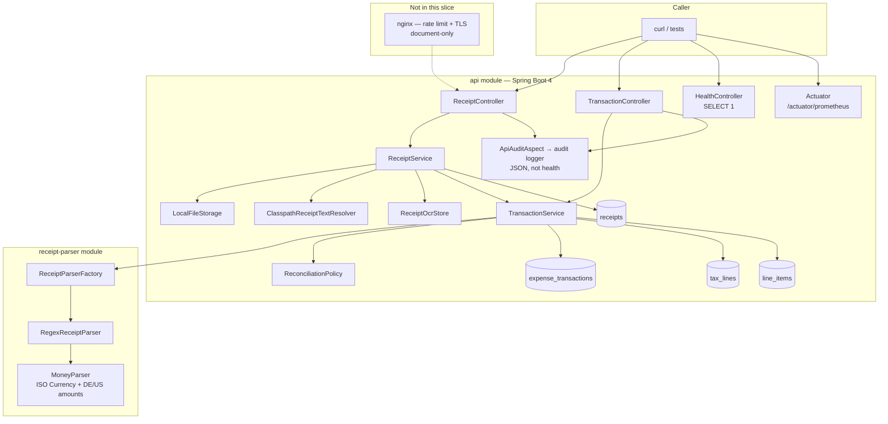

# Demo script — receipt auto-itemize API

Presenter notes for a walkthrough. Commands assume the repo root. Keep two terminals: **A** for the app (`./gradlew bootRun`), **B** for tests and curls.

If Boot is already running from an earlier session, restart it so H2 console and the latest parser/health changes are live.

---

## 0. Before you start

**Java 21** (see [README](README.md) setup). App: `http://localhost:8080`. OCR is stubbed: upload filename stem → `fixtures/task-a/{stem}.txt`.

| Terminal | Use for |
|---|---|
| **A** | App — `./gradlew bootRun` or `./scripts/run-api.sh` — leave this visible for audit JSON |
| **B** | tests, curls, this script |

```bash
./gradlew bootRun
```

Wait until Tomcat is listening. Health should already include `SELECT 1`:

```bash
curl -s http://localhost:8080/health
# {"status":"UP"}
```

---

## 1. Architecture (~5 min)

### Say

This is a 24h take-home slice: upload a receipt, persist **taxes as their own rows**, auto-itemize, and mark `NEEDS_REVIEW` when the math does not work. We do **not** invent a balancing line. No OCR vendor and no LLM at runtime.

Two Gradle modules:

- **`receipt-parser`** — no Spring. Deterministic extraction from OCR text, with its own tests.
- **`api`** — Spring Boot 4.1, JPA, H2, HTTP.

The API never parses receipts itself. `ReceiptParserFactory` selects `REGEX` → `RegexReceiptParser`. A later LLM/OCR parser is a new `ReceiptParserKind`, not a rewrite of the controllers.

OCR: strip the upload extension, load `{basename}.txt` from the classpath (`fixtures/task-a/`). Unknown names → `400 OCR_TEXT_NOT_FOUND`. Unparseable text → `400 RECEIPT_PARSE_FAILED` and **no** transaction (we do not persist a `FAILED` header with null merchant/date/currency).

### Diagram



### Point at while you talk

| Layer | What to say |
|---|---|
| Controllers | Thin HTTP. `ReceiptController` upload/process; `TransactionController` get / itemize / PATCH items. |
| Services | File on disk + raw OCR in `receipts`. Process creates one transaction, many tax rows, many line items. Itemize **replaces items only**. |
| Parser | Whitelist labels (`MERCHANT`, `DATE`, `CURRENCY`, `TOTAL`, `SUBTOTAL`). Unknown labels → `UNPARSEABLE`. Bare values with no labels → `MISSING`. `java.util.Currency` for ISO codes; comma decimals (`17,85`, `1.234,56`). |
| Policy | Items + taxes vs grand total. Zero/negative amounts stay stored but `NEEDS_REVIEW`. Empty items (tax-only) → `NEEDS_REVIEW`. |
| Cross-cutting | AOP audit on API controllers except health. Prometheus scrape. Health hits the DB. |

Data model after a successful `process`:

```
receipts 1──1 expense_transactions 1──* tax_lines
                               └──* line_items
```

`itemize_status`: `COMPLETE` | `NEEDS_REVIEW` | `FAILED` (enum exists; invalid OCR is 400 instead of a FAILED row).

---

## 2. Validation, audit, observability, nginx (~5 min)

### Validation

| Concern | Behaviour |
|---|---|
| Required fields | merchant, date, ISO currency, grand total. Reasons: `MISSING`, `INVALID`, `NON_NUMERIC`, `UNPARSEABLE`. |
| Garbled vs unlabeled | Labels outside the whitelist (e.g. `MERCH#NT`, or `VENDOR:`) → `UNPARSEABLE`. Values with no labels → `MISSING`. |
| Currency / amounts | `Currency.getInstance` (not “any 3 letters”). German `,` decimals and thousands. `€` → `EUR`. `FOO` → `INVALID`. |
| Process on bad OCR | **400** `RECEIPT_PARSE_FAILED` + `fields[]`. Receipt + raw OCR kept; **no** transaction. |
| Unknown upload name | **400** `OCR_TEXT_NOT_FOUND`. |
| Itemize / PATCH bad id | **400** `INVALID_TRANSACTION_ID` (malformed UUID **or** unknown UUID). GET missing → **404**. |
| PATCH math | **409** `ITEMIZATION_MISMATCH` with stored total vs item/tax sums. Totals are not rewritten. |
| Mismatch receipts | Persist as-is, `NEEDS_REVIEW`, no synthetic line. |
| Health | `SELECT 1`; **503** `{ "status": "DOWN" }` if the DB ping fails. |

### Audit

- Spring AOP around `@RestController`, **excluding** `HealthController` (probes would drown the log).
- One **JSON line** on logger `audit` (snake_case): method, path, status, duration_ms, outcome `SUCCESS`/`ERROR`, error code, receipt/transaction ids, upload filename/type/size.
- **No** OCR text or file bytes in the log (multipart → filename only).

### Observability

- Micrometer Prometheus registry. Scrape **`GET /actuator/prometheus`**.
- Default JVM + HTTP + Hikari meters. No Prometheus/Grafana process — scrape only, ~15 minutes vs a metrics stack.
- Custom `/health` kept for the brief; actuator health is also exposed but the demo uses `/health` + the scrape endpoint.

### Nginx (explored, not built — choice “document-only”)

**Recommendation we made:** keep `./gradlew bootRun` as the scored path. A gateway does not help matching `gold.json`. The brief treats production edge (auth, TLS, rate limits) as out of scope.

| If we added it later | Trade-off |
|---|---|
| Thin **nginx sidecar** (compose): `limit_req` by IP → **429**; optional TLS profile; Spring stays HTTP; forward `X-Forwarded-*` | Right shape for rate limit + HTTPS. ~45–90 min HTTP+limits, +30–45 TLS, +45–90 if you prove 429/HTTPS. Those tests must **not** sit in Java e2e or fixture flows flake on 429. |
| Make compose **required** to run | Fights the brief (one Gradle command + curls). |
| Spring Cloud Gateway / Kong / Let’s Encrypt | Extra product surface, not a 60–120 min slice. |
| Rate limit **inside** Spring | Possible (`bucket4j`), but TLS and connection limits still want a proxy. |

**Say:** “We documented the gateway; we implemented audit + Prometheus in-process because those are small Spring adds and they show up in this demo.”

---

## 3. Unit tests — run and talk through coverage (~4 min)

In **terminal B**:

```bash
./gradlew test --console=plain
```

While it runs, walk the map. `./gradlew test` is **unit/WebMvc** only (parser module + `api` `src/test`). E2E is a separate source set on purpose so contract tests can stay slow/isolated.

### `receipt-parser`

| Test | What it proves |
|---|---|
| `ReceiptParserFactoryTest` | Factory default / `REGEX` → `RegexReceiptParser`. |
| `RegexReceiptParserTest` | Gold fixtures (clean, tax-only, mismatch, 100 items, big/zero/negative, German commas). Invalid fixtures vs `gold-errors.json`. Whitelist vs unlabeled. No invented balancing line. |
| `MoneyParserTest` | `17,85` / `1.234,56` / `1,234.56`; ISO codes via `Currency`; `€`; reject `FOO`. |

### `api`

| Test | What it proves |
|---|---|
| `HealthControllerTest` | `SELECT 1` → 200 UP; failure → 503 DOWN. |
| `ReceiptControllerTest` | Upload id; process body; 400 parse; 400 unknown OCR name. |
| `TransactionControllerTest` | GET / itemize / PATCH; 400 invalid id; 409 mismatch. |
| `TransactionServiceTest` | Missing GET is 404; invalid ids 400. |
| `DefaultReconciliationPolicyTest` | COMPLETE vs NEEDS_REVIEW; zero/negative; no fake lines. |
| `ClasspathReceiptTextResolverTest` | Filename → fixture text. |
| `ApiAuditAspectTest` / `JsonSlf4jAuditPublisherTest` | SUCCESS/ERROR events; snake_case JSON; no OCR/bytes in the log. |

**Say after BUILD SUCCESSFUL:** parser is locked to gold; HTTP mappings and policy are unit-tested without Boot-on-random-port.

---

## 4. Live curls — audit log + scrape (~6 min)

App must be up in **terminal A**. Point at A when you curl; each API call (not health) appends one JSON line from `audit`.

### 4a. Health (not audited)

```bash
curl -s http://localhost:8080/health
```

**Say:** “Probes skip the audit aspect so liveness noise stays out of the audit stream. This path still runs `SELECT 1`.”

### 4b. Happy path — watch terminal A

```bash
RECEIPT_ID=$(curl -s -F "file=@fixtures/task-a/receipt-clean.txt;filename=receipt-clean.png" \
  http://localhost:8080/receipts | python3 -c "import sys,json; print(json.load(sys.stdin)['receipt_id'])")
echo "receipt_id=$RECEIPT_ID"

curl -s -X POST "http://localhost:8080/receipts/$RECEIPT_ID/process" | python3 -m json.tool
```

In **A**, two audit lines. Upload looks like:

```json
{
  "http_method": "POST",
  "path": "/receipts",
  "status": 200,
  "outcome": "SUCCESS",
  "error": null,
  "upload_filename": "receipt-clean.png",
  "upload_content_type": "text/plain"
}
```

Process looks like:

```json
{
  "http_method": "POST",
  "path": "/receipts/<uuid>/process",
  "status": 200,
  "outcome": "SUCCESS",
  "receipt_id": "<uuid>",
  "duration_ms": 12
}
```

Copy `transaction_id` from the process body (Cafe Mitte, EUR, `17.85`, VAT row, three items, `COMPLETE`).

Optional GET (third audit line):

```bash
TRANSACTION_ID=<paste>
curl -s "http://localhost:8080/transactions/$TRANSACTION_ID" | python3 -m json.tool
```

### 4c. Validation failure — garbled OCR

```bash
BAD_ID=$(curl -s -F "file=@fixtures/task-a/receipt-garbled.txt;filename=receipt-garbled.png" \
  http://localhost:8080/receipts | python3 -c "import sys,json; print(json.load(sys.stdin)['receipt_id'])")

curl -s -X POST "http://localhost:8080/receipts/$BAD_ID/process" | python3 -m json.tool
```

Expect **400**:

```json
{
  "error": "RECEIPT_PARSE_FAILED",
  "fields": [
    { "name": "merchant", "reason": "UNPARSEABLE" },
    { "name": "date", "reason": "UNPARSEABLE" },
    { "name": "currency", "reason": "UNPARSEABLE" },
    { "name": "grand_total", "reason": "UNPARSEABLE" }
  ]
}
```

In **A**, process audit: `"outcome":"ERROR"`, `"error":"RECEIPT_PARSE_FAILED"`, `"status":400`. Filename only — not the garbled OCR.

**Say:** “Whitelist, not a list of known typos. `MERCH#NT` is just not `MERCHANT`.”

### 4d. Prometheus scrape

```bash
curl -s http://localhost:8080/actuator/prometheus | egrep 'http_server_requests_seconds_count|jvm_memory_used_bytes|hikaricp_connections' | head -n 40
```

**Say:** “This is the scrape target. We did not run Prometheus or Grafana. After the curls you should see `http_server_requests_seconds_count` for `/receipts` and `/health`. Hikari shows the pool the health check used.”

Optional wide peek:

```bash
curl -s http://localhost:8080/actuator/prometheus | head
```

---

## 5. Ad-hoc SQL (~4 min)

In-memory H2 (`jdbc:h2:mem:navan`) lives in the Boot JVM. Console: **http://localhost:8080/h2-console**

Connect:

| Field | Value |
|---|---|
| JDBC URL | `jdbc:h2:mem:navan` |
| User | `sa` |
| Password | *(empty)* |

Run these in order. They assume the curls in §4 (clean process + garbled upload/process).

**Tables and the clean transaction**

```sql
SHOW TABLES;

SELECT id, original_filename, content_type,
       length(raw_ocr_text) AS ocr_chars
FROM receipts
ORDER BY created_at;
```

**Say:** both uploads have OCR text. Garbled still stored so we could retry parse later.

```sql
SELECT t.id, t.merchant, t.currency, t.grand_total, t.itemize_status, t.receipt_id
FROM expense_transactions t;
```

Expect **one** transaction (Cafe Mitte). Garbled never got a row.

```sql
SELECT r.original_filename,
       t.id AS transaction_id,
       t.itemize_status
FROM receipts r
LEFT JOIN expense_transactions t ON t.receipt_id = r.id
ORDER BY r.created_at;
```

Garbled filename → `transaction_id` NULL.

**Taxes are rows, not a column on the header**

```sql
SELECT t.merchant, x.name, x.rate, x.amount
FROM tax_lines x
JOIN expense_transactions t ON t.id = x.transaction_id;
```

VAT `0.1900` / `2.85`.

**Line items; no fake balancing line**

```sql
SELECT description, amount
FROM line_items
ORDER BY description;
```

Espresso 3.50, Mineral water 2.60, Sandwich 8.90. Sum + VAT = 17.85.

```sql
SELECT t.grand_total,
       (SELECT sum(amount) FROM line_items i WHERE i.transaction_id = t.id) AS items,
       (SELECT sum(amount) FROM tax_lines x WHERE x.transaction_id = t.id) AS taxes
FROM expense_transactions t;
```

**Say:** “This is the reconciliation policy in SQL form. PATCH 409 is the same check when the user edits items.”

Optional extra (if you still have time): process `receipt-mismatch.pdf` via curl, re-run the last query — items + tax ≠ `grand_total`, status `NEEDS_REVIEW`, still two items only.

---

## 6. E2E tests — talk through, then run (~5 min)

### Say before you run

`api/src/e2eTest` is a **separate Gradle source set** (`./gradlew e2eTest` / `check`). It boots the real app on a **random port** (`@SpringBootTest`) and drives HTTP with `RestTestClient`. It is the API contract, not a second copy of parser unit tests.

Gold files on the classpath (`gold.json`, `gold-errors.json`) are the fixture contract the brief grades.

Walk `ReceiptApiContractE2ETest` (open the file if you can):

| Test | Contract |
|---|---|
| `healthIsUp` | `/health` → `UP` (and therefore DB ping). |
| `prometheusScrapeIsExposed` | `/actuator/prometheus` contains `jvm_`. |
| `processMatchesGold` | **clean / tax-only / mismatch**: upload → process → GET → itemize. Merchant, currency, total, itemize_status, line count vs gold. |
| `hundredItemsWithValidSubtotalAreComplete` | 100 items, subtotal skipped as an item, `COMPLETE`. |
| `hundredItemsWithInvalidSubtotalNeedReviewAndKeepAllItems` | Still 100 items, total unchanged, `NEEDS_REVIEW`. |
| `largeAmountsStayCompleteWhenTheyReconcile` | Big positives still `COMPLETE`. |
| `zeroAmountsNeedReview` / `negativeAmountsNeedReview` | Persisted, but review. |
| `mismatchMustNotInventBalancingLine` | Two items, total 18.50, `NEEDS_REVIEW`. |
| `patchValidItemsOnCleanReceiptSucceeds` | User override that still reconciles → 200. |
| `patchMismatchItemsReturns409` | `ITEMIZATION_MISMATCH`. |
| `invalidFixturesReturn400AndDoNotCreateTransaction` | garbled, non-numeric, unlabeled, missing-* vs `gold-errors.json`. |
| `unknownFilenameReturnsOcrNotFound` | 400. |
| `itemizeAndPatchInvalidIdsReturn400` | `not-a-uuid` **and** random UUID → `INVALID_TRANSACTION_ID`. GET missing stays 404 (covered in unit tests). |

**Say:** “E2E is extendable: add a fixture, gold row, and a `@ValueSource` name.”

BootRun in **A** can stay up; the default e2e runner starts the **fat jar** on port **18080**, so it will not reuse this process.

```bash
./gradlew e2eTest --console=plain
# or: ./scripts/run-e2e.sh
```

Watch names appear. After **BUILD SUCCESSFUL**, close on: parser gold + HTTP contract + audit/metrics in the running app, nginx deliberately not in the slice.

---

## Cheat sheet (order of operations)

1. Restart `./gradlew bootRun` if needed.
2. Architecture diagram + module split + factory + OCR stub.
3. Validation / audit / Prometheus / nginx table.
4. `./gradlew test --console=plain`.
5. Curls: health, clean process, garbled 400 — read **audit** in the Boot terminal.
6. `curl …/actuator/prometheus`.
7. [H2 console](http://localhost:8080/h2-console) + SQL above.
8. Talk through `ReceiptApiContractE2ETest`, then `./gradlew e2eTest --console=plain`.

If something 404s on `/h2-console`, Boot was started before console was enabled — restart terminal **A**.
