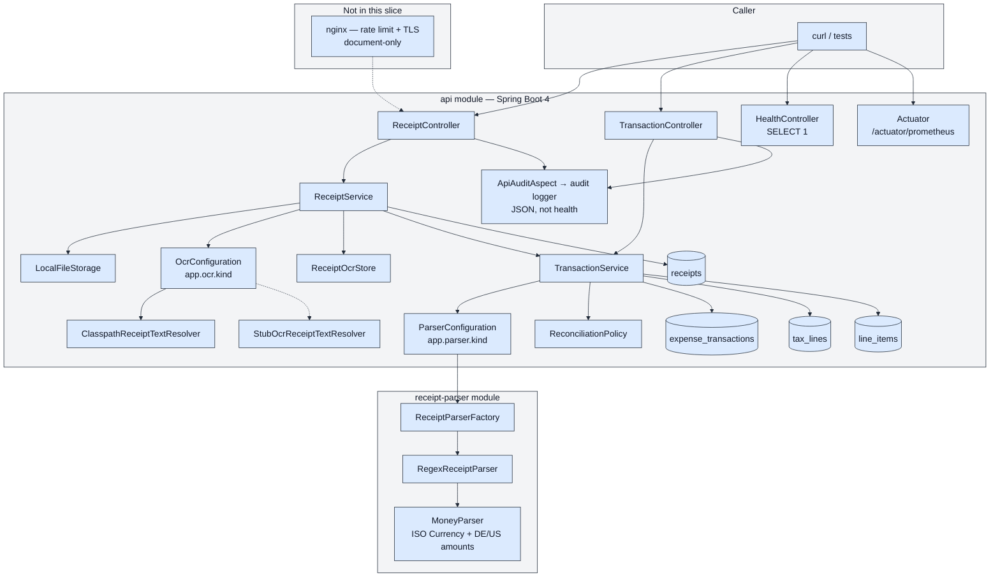

# Submission — Task A (receipt upload, taxes, auto-itemize)

Nick Mann. Checklist from `task-a/task-a-receipt-autoitemize-CANDIDATE.md` § Submit.

## 1. Git repo URL + commit SHA

| | |
|---|---|
| **Repo** | https://github.com/mannnick24/navan-expense |
| **SHA** | `35c271be4d0a5408734975589c66ab87e8ae820b` |

If you commit after this file, replace the SHA with `git rev-parse HEAD`.

## 2. How to run + example curls

Java 21. Gradle wrapper (no separate Gradle install). H2 is in-process. No Docker, no OCR key.

**One command:**

```bash
./scripts/run-api.sh
```

(or `./gradlew bootRun`). API: `http://localhost:8080`.

Upload bodies must be image or PDF. Use `fixtures/task-a/upload.png` (or `upload.pdf`) and set `filename=` to the OCR-stub stem (e.g. `receipt-clean.png`).

### Health

```bash
curl -s http://localhost:8080/health
```

### Prometheus scrape

```bash
curl -s http://localhost:8080/actuator/prometheus | head
```

### `POST /receipts` then `POST /receipts/{id}/process`

```bash
RECEIPT_ID=$(curl -s -F "file=@fixtures/task-a/upload.png;filename=receipt-clean.png;type=image/png" \
  http://localhost:8080/receipts | python3 -c "import sys,json; print(json.load(sys.stdin)['receipt_id'])")

curl -s -X POST http://localhost:8080/receipts/$RECEIPT_ID/process
```

### `GET /transactions/{id}`

```bash
curl -s http://localhost:8080/transactions/$TRANSACTION_ID
```

### `POST /transactions/{id}/itemize`

```bash
curl -s -X POST http://localhost:8080/transactions/$TRANSACTION_ID/itemize
```

### `PATCH /transactions/{id}/items`

Must still reconcile with stored total + taxes.

```bash
curl -s -X PATCH http://localhost:8080/transactions/$TRANSACTION_ID/items \
  -H 'Content-Type: application/json' \
  -d '{"items":[{"description":"Espresso","amount":3.50},{"description":"Sandwich","amount":8.90},{"description":"Mineral water","amount":2.60}]}'
```

### Parse failure (400)

```bash
BAD_ID=$(curl -s -F "file=@fixtures/task-a/upload.png;filename=receipt-garbled.png;type=image/png" \
  http://localhost:8080/receipts | python3 -c "import sys,json; print(json.load(sys.stdin)['receipt_id'])")
curl -s -X POST http://localhost:8080/receipts/$BAD_ID/process
```

### Invalid transaction id (400)

```bash
curl -s -X POST http://localhost:8080/transactions/not-a-uuid/itemize
curl -s -X PATCH http://localhost:8080/transactions/not-a-uuid/items \
  -H 'Content-Type: application/json' \
  -d '{"items":[{"description":"Water","amount":4.00}]}'
```

Tests:

```bash
./gradlew test
./gradlew e2eTest
./gradlew check
```

## 3. OCR / model

**OCR is stubbed.** No OCR vendor, Vision API, or LLM is called at runtime. No API keys.

- Upload `filename` stem → classpath `fixtures/task-a/{stem}.txt` (`ClasspathReceiptTextResolver`, `app.ocr.kind=fixture`).
- Extraction is a deterministic regex parser (`app.parser.kind=regex` → `RegexReceiptParser`).
- `app.ocr.kind=ocr` is a non-functional vendor placeholder (`StubOcrReceiptTextResolver`).

The three brief fixtures (`receipt-clean`, `receipt-tax-only`, `receipt-mismatch`) match `fixtures/task-a/gold.json`.

## 4. Architecture

Upload a receipt, persist **taxes as their own rows**, auto-itemize, and mark `NEEDS_REVIEW` when the math does not work. Do **not** invent a balancing line. No OCR vendor and no LLM at runtime.

Two Gradle modules:

- **`receipt-parser`** — no Spring. Deterministic extraction from OCR text, with its own tests and a factory for a later impl.
- **`api`** — Spring Boot 4.1, JPA, H2, HTTP.

The API never parses receipts itself. Spring injects both seams from config:

| Property | Default | Bean |
|---|---|---|
| `app.parser.kind` | `regex` | `ParserConfiguration` → `ReceiptParserFactory` → `RegexReceiptParser` |
| `app.ocr.kind` | `fixture` | `OcrConfiguration` → `ReceiptTextResolverFactory` → `ClasspathReceiptTextResolver` |

`app.ocr.kind=ocr` selects `StubOcrReceiptTextResolver` (placeholder that would read the stored file and call a vendor).

OCR fixture: strip the upload extension, load `{basename}.txt` from the classpath (`fixtures/task-a/`). Unknown names → `400 OCR_TEXT_NOT_FOUND`. Unparseable text → `400 RECEIPT_PARSE_FAILED` and **no** transaction.

`POST /receipts` stores the file and a `receipts` row (image/PDF content type + magic bytes, or **415**). `POST /receipts/{id}/process` resolves stub OCR, persists raw text, then creates one **transaction**, **tax lines**, and **line items**. Itemize replaces items only. PATCH items returns **409** if amounts no longer reconcile. Status is `COMPLETE` or `NEEDS_REVIEW` (zero/negative amounts stay stored but review).

Cross-cutting: AOP JSON audit (not health), Prometheus scrape, `/health` with `SELECT 1`. Nginx rate-limit/TLS was explored and left document-only.

Data model after a successful `process`:

```
receipts 1──1 expense_transactions 1──* tax_lines
                               └──* line_items
```

`itemize_status`: `COMPLETE` | `NEEDS_REVIEW` | `FAILED` (enum exists; invalid OCR is 400 instead of a FAILED row).


